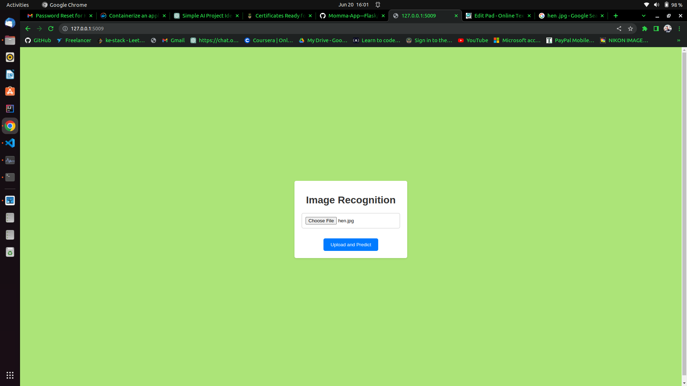
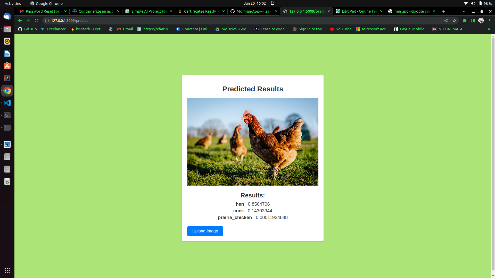

# Flask-Image-Recognition

Flask Image Recognition is a web application that allows users to upload an image and performs object recognition using a pre-trained ResNet50 model. The predicted results are displayed on a separate page.

# Screenshots

# Prerequisites

Python 3.x
Flask
TensorFlow
Keras

# Installation

Clone the repository:

## git clone https://github.com/kelvin-kahuho/Flask-Image-Recognition.git

Navigate to the project directory:

## cd flask-image-recognition

Install the required dependencies:

## pip install -r requirements.txt

# Usage

Start the Flask application

## python app.py

Open a web browser and go to http://localhost:5000/.

You will be presented with an upload page where you can select an image file.

Choose an image file and click on the "Upload and Predict" button.

The application will process the uploaded image and display the predicted results on a separate page.

# Customization

You can modify the image size used for preprocessing in the app.py file by changing the target_size parameter in the image.load_img() function.

To use a different pre-trained model, such as VGGNet or Inception, modify the model import statement in the app.py file accordingly.

# License
This project is licensed under the MIT License.

# Acknowledgements
The pre-trained model used in this project is provided by Keras and TensorFlow. For more information on the pre-trained models, please refer to the official Keras Applications documentation.

# Contributing
Contributions to the Flask Image Recognition project are welcome! If you find any bugs or have suggestions for improvements, please open an issue or submit a pull request.

# Contact
If you have any questions or need further assistance, feel free to reach out to the project maintainer at kingorikelvin883@gmail.com.

